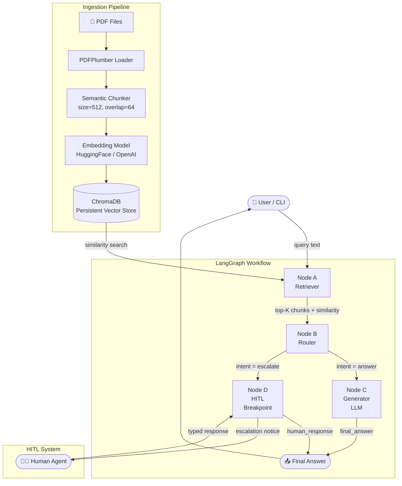

# High-Level Design (HLD)
## RAG-Based Customer Support Assistant

---

## 1. System Overview

### Problem Definition
Customer support teams face a recurring bottleneck: agents spend significant time answering questions that are already documented in product manuals, FAQs, and policy PDFs. A Retrieval-Augmented Generation (RAG) system addresses this by grounding LLM responses in a verified knowledge base, reducing hallucination and enabling instant, accurate answers.

### Scope
- Ingest one or more PDF documents into a persistent vector store.
- Accept natural-language queries via CLI (extensible to web).
- Retrieve semantically relevant document chunks and generate contextual answers.
- Route low-confidence queries to a human agent via a HITL escalation flow.
- Maintain a full audit trail of node execution for every query.

---

## 2. Architecture Diagram



---

## 3. Component Descriptions

| Component | Responsibility |
|---|---|
| **Document Loader** (`ingestion/loader.py`) | Opens PDFs with PDFPlumber, extracts per-page text, returns `RawDocument` objects. |
| **Chunker** (`ingestion/chunker.py`) | Splits pages into overlapping character windows. Produces `Chunk` objects with source metadata. |
| **Embedding Model** (`ingestion/embedder.py`) | Converts text to dense vectors. Supports OpenAI `text-embedding-3-small` and HuggingFace `all-MiniLM-L6-v2`. |
| **Vector Store** (`ingestion/vector_store.py`) | Wraps ChromaDB. Handles upsert (idempotent), cosine similarity search, and persistence. |
| **Retriever Node** (`graph/nodes.py`) | Queries the vector store for top-K chunks, synthesises a numbered context block. |
| **Router Node** (`graph/nodes.py`) | Evaluates `top_similarity` against threshold. Sets `intent = "answer"` or `"escalate"`. |
| **Generator Node** (`graph/nodes.py`) | Constructs a grounded prompt and calls the LLM. Detects LLM-expressed uncertainty and re-escalates. |
| **HITL Node** (`graph/nodes.py`) | Marks the state for escalation. The CLI handler blocks for human input. |
| **Graph Workflow** (`graph/workflow.py`) | Assembles the `StateGraph`, wires conditional edges, compiles to a callable. |
| **HITL Handler** (`hitl/handler.py`) | Prints escalation notice, blocks for human input with configurable timeout, returns response. |

---

## 4. Data Flow

```
PDF File
  └─► PDFPlumber (page text)
        └─► Chunker (512-char windows, 64-char overlap)
              └─► Embedding Model (dense vectors)
                    └─► ChromaDB (upsert with cosine index)

Query
  └─► Embedding Model (query vector)
        └─► ChromaDB (top-K cosine search)
              └─► Retriever Node (context synthesis)
                    └─► Router Node (confidence check)
                          ├─► [high confidence] Generator Node → LLM → Answer
                          └─► [low confidence] HITL Node → Human Agent → Answer
```

### Query Lifecycle
1. User submits a question.
2. The question is embedded into a vector.
3. ChromaDB returns the top-5 most similar chunks with cosine similarity scores.
4. The Router checks if `top_similarity ≥ 0.70`.
5. If yes → Generator builds a grounded prompt and calls the LLM.
6. If no → HITL handler pauses execution and waits for a human agent.
7. The final answer (LLM or human) is returned to the user.

---

## 5. Technology Choices

| Technology | Rationale |
|---|---|
| **ChromaDB** | Embedded, zero-infrastructure vector store. Persists to disk. Supports cosine similarity natively. Ideal for single-node deployments and prototypes that need to scale to a managed service later. |
| **LangGraph** | Provides a stateful, graph-based execution model with explicit node boundaries, conditional routing, and interrupt support — essential for HITL. Superior to linear chains for production control flow. |
| **PDFPlumber** | More accurate text extraction than PyPDF2, especially for tables and multi-column layouts common in product manuals. |
| **sentence-transformers/all-MiniLM-L6-v2** | 384-dim embeddings, runs on CPU, no API key required. Suitable for offline/air-gapped deployments. |
| **OpenAI text-embedding-3-small** | Higher quality embeddings for production deployments where API access is available. |
| **google/flan-t5-base** | Lightweight offline LLM for environments without OpenAI access. Swappable for GPT-4o-mini in production. |

---

## 6. Scalability Considerations

### Large Documents
- Chunking is stateless and parallelisable — use `multiprocessing.Pool` to chunk multiple PDFs concurrently.
- ChromaDB supports millions of vectors on a single node; migrate to Chroma Cloud or Pinecone for distributed scale.

### Increasing Query Load
- The embedding model is the primary bottleneck. Cache query embeddings with an LRU cache keyed on query text.
- Deploy the graph as a FastAPI service behind a load balancer for horizontal scaling.
- Use async LangGraph invocation (`graph.ainvoke`) to handle concurrent requests without blocking.

### Latency
- HuggingFace embedding on CPU: ~50–200ms per query.
- OpenAI embedding API: ~100–300ms round-trip.
- ChromaDB local query: <10ms for collections under 100K chunks.
- LLM generation (flan-t5-base CPU): 1–5s. Switch to GPT-4o-mini for <1s responses.
- Total P95 latency target: <3s for automated answers, <5 min for HITL (human SLA).
